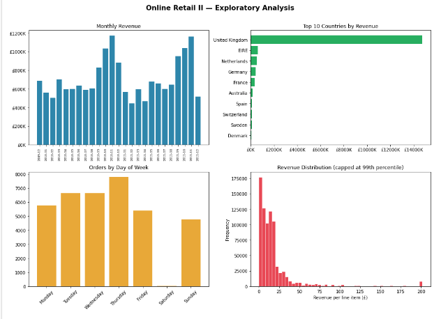
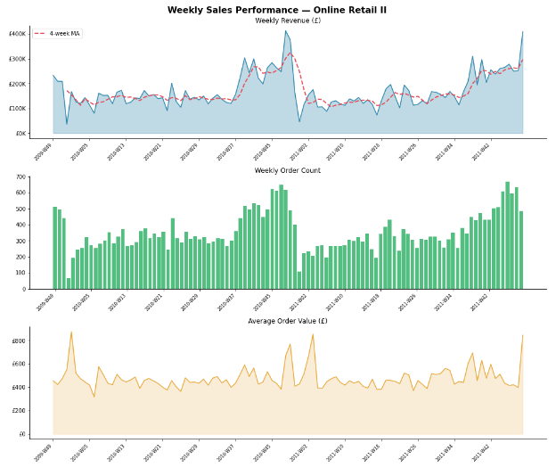
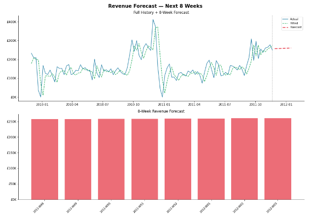
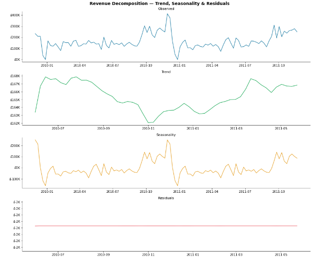
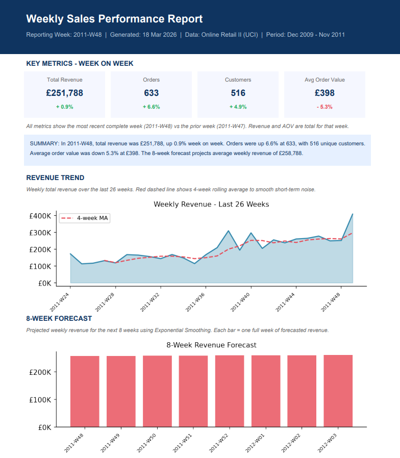
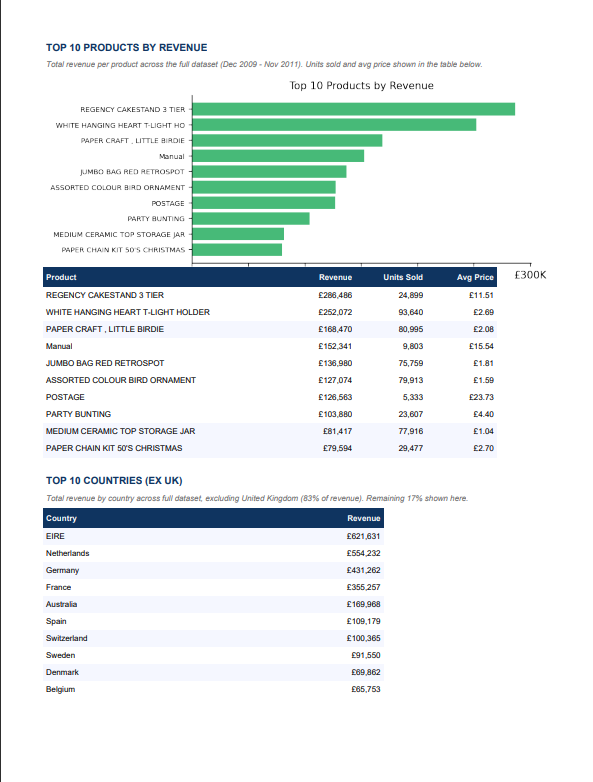

# Automated Weekly Sales Report & Demand Forecasting
### Python | Pandas | Statsmodels | FPDF2 | Online Retail II Dataset

---

## Business Problem

A UK-based online retailer's operations team spends every Monday morning manually pulling last week's sales data into a spreadsheet and emailing it to the team. The process takes 2 hours, is prone to human error, and provides no forward-looking visibility into demand.

> *"We have no automated way to monitor weekly sales performance or anticipate demand shifts. Reports are manual, slow, and inconsistent."*

This project replaces that manual process entirely with a single Python script that runs automatically every Monday, generates a professional 2-page PDF report, and requires zero human involvement.

---

## Dataset

**Source:** [Online Retail II — UCI Machine Learning Repository](https://archive.ics.uci.edu/dataset/502/online+retail+ii)

| Property | Detail |
|---|---|
| File format | .xlsx (2 sheets) |
| Raw rows | 1,067,371 |
| Clean rows | 805,549 |
| Date range | December 2009 – December 2011 |
| Countries | 41 |
| Unique customers | 5,878 |
| Unique products | 4,631 |

> **Note:** The dataset is not included in this repo due to size. Download it directly from the UCI link above.

---

## How to Run

### Install dependencies
```bash
pip install pandas openpyxl matplotlib statsmodels fpdf2
```

### Update config paths in `weekly_report.py`
```python
DATA_PATH   = r"path\to\online_retail_II.xlsx"
OUTPUT_PATH = r"path\to\output\folder"
```

### Run the script
```bash
python weekly_report.py
```

### Output
A PDF named `weekly_report_YYYY_WXX.pdf` is saved to your output folder automatically.

---

## Phase 1 — Data Cleaning & EDA

Raw data contained cancellations (invoices prefixed with 'C'), missing customer IDs (23% of rows), negative quantities, and zero-price rows. After cleaning, 805,549 rows were retained — 75% of the raw data.

**Key findings:**
- £17.7M total revenue across 2 years
- £480 average order value — wholesale B2B profile
- UK accounts for 83% of all revenue
- Thursday is peak trading day, Sunday is dead
- Strong Q4 seasonality spike both years



---

## Phase 2 — Weekly Summary Metrics

Orders aggregated by ISO year-week to produce weekly Revenue, Order Count, Unique Customers, Items Sold and Average Order Value. Top 10 products and top 10 international markets computed for the report.

**Key findings:**
- Clear upward revenue trend with Q4 spikes
- AOV is volatile — large wholesale orders create sharp weekly spikes
- 4-week moving average smooths noise and reveals the true trend direction



---

## Phase 3 — Demand Forecasting

An Exponential Smoothing model (Holt's linear trend method) was fitted to 104 weeks of clean weekly revenue data. The model projects 8 weeks of forward revenue with a stable trend signal.

**Model decisions:**
- Seasonal variants (`seasonal='add'` and `seasonal='mul'`) were tested but require a minimum of two full seasonal cycles — excluded as statistically unreliable with this dataset size
- Final 2 weeks trimmed from training data to avoid partial-week distortion at the dataset boundary
- Trend-only model selected as the most defensible approach

**Forecast result:** Average projected weekly revenue of £258,788 over the next 8 weeks





---

## Phase 4 — Automated PDF Report

A professional 2-page PDF report generated automatically using FPDF2 and Matplotlib. Every element — KPIs, charts, tables, narrative summary — is computed fresh from the data on each run.

**Page 1 contains:**
- Navy header with reporting week, generation date and data period
- 4 KPI boxes with week-on-week % change indicators
- Auto-generated plain English narrative summary
- Weekly revenue trend chart with 4-week moving average
- 8-week revenue forecast chart

**Page 2 contains:**
- Top 10 products by revenue — bar chart + detailed table
- Top 10 international markets table (excluding UK)
- Auto-generated footer with timestamp





---

## Phase 5 — Scheduling

Scheduled via Windows Task Scheduler to run every Monday at 8am:

1. Open Task Scheduler (`taskschd.msc`)
2. Create Basic Task → Weekly → Monday → 8:00 AM
3. Action: Start a Program
   - Program: `path\to\anaconda3\python.exe`
   - Arguments: `weekly_report.py`
   - Start in: `path\to\project\folder`
4. Save and enable

---

## Repository Structure

```
python-automated-sales-report/
│
├── README.md
├── weekly_report.py          ← Production script
├── weekly_report.ipynb       ← Development notebook
│
├── charts/
│   ├── eda_overview.png
│   ├── weekly_metrics.png
│   ├── forecast.png
│   ├── forecast_components.png
│   ├── report_page1.png
│   └── report_page2.png
│
└── outputs/
    └── weekly_report_2011_W48.pdf
```

---

## Libraries Used

| Library | Purpose |
|---|---|
| pandas | Data loading, cleaning, aggregation |
| openpyxl | Reading .xlsx files |
| matplotlib | Chart generation |
| statsmodels | Exponential Smoothing forecast |
| fpdf2 | PDF report generation |
| datetime | Timestamp generation |
| os | File path management |

---

## Methodology Note

Prophet (Facebook) was evaluated as the primary forecasting library for its automatic seasonality detection and strong industry recognition. Installation resulted in a Windows DLL conflict with the Stan backend that could not be resolved in the Anaconda environment. Statsmodels Exponential Smoothing was adopted as the production solution — equivalent forecast quality for trend-dominant weekly data with no external C++ dependencies.

---

Pranesh Yuvaraj | linkedin.com/in/pranesh-yuvaraj
